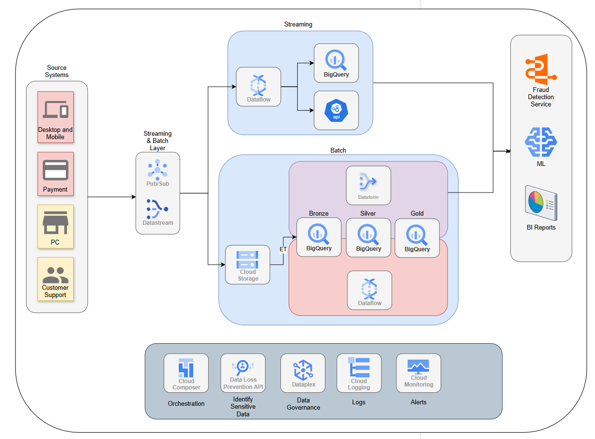

# ShopStream Case

### Project Architecture



### Project Structure

```
ShopStream/
├── .github/                  # GitHub workflows (In development)
├── airflow/                  # Airflow project (In development)
├── content/                  # Documentation, diagrams, and reference files
│   ├── ShopStream-Architecture.png
│   ├── ShopStream_Architecture.drawio
│   └── Take Home Assessment.pdf
├── definitions/              # Dataform definitions and quality checks
│   ├── 1_bronze/
│   ├── 2_silver/
│   ├── 3_gold/
│   ├── external_tables/      # BigQuery external tables scripts
│   └── quality_checks/
├── shopstream/               # Main source code
│   ├── 1_api_sources/        # GCF to simulate source ingestion
│   │   ├── __init__.py
│   │   ├── main.py
│   │   ├── requirements.txt
│   │   ├── source-data/
│   │   └── utils.py
│   ├── 2_pubsub-2-gcs/       # PubSub to GCS pipeline (only for local dev)
│   │   ├── README.md
│   │   ├── main.py
│   │   └── requirements.txt
│   ├── .python-version
│   ├── .venv/
│   ├── pyproject.toml
│   └── uv.lock
|
├── .gitignore
├── .pre-commit-config.yaml
├── LICENSE
├── Makefile
├── dataform.json
├── package.json
├── package-lock.json
├── shopstream-proj-b2c90a6ef5a1.json
└── README.md
```

- `content/`: Contains architecture diagrams and documentation.
- `definitions/`: Houses Dataform pipeline layer definitions and quality checks.
- `shopstream/`: Main Python source code, with submodules for API ingestion and PubSub-to-GCS pipeline.
- Root files: Project configuration, environment, and dependency management.

### Project Setup

#### Prerequisites

- Make:

Ensure make is installed by running `make --version`.

- uv:

Install uv by following the instructions at https://docs.astral.sh/uv/getting-started/installation/

After install ensure uv is installed by running `uv --version`.

- gcloud:

Install gcloud by following the instructions at https://cloud.google.com/sdk/docs/install

After install ensure gcloud is installed by running `gcloud --version`.

#### Local Setup

Install dependencies by running `make setup`.

#### Local Test

Run pubsub emulator by running `make run_pubsub_emulator`.

Run gcf source by running `make run_gcf_source`.

Run gcf pubsub to gcs by running `make run_gcf_pubsub_to_gcs`.

Run source request by running `make source_request`.

Run pubsub to gcs request by running `make pubsub_to_gcs_request`.


#### Dev Test

To be continued...

